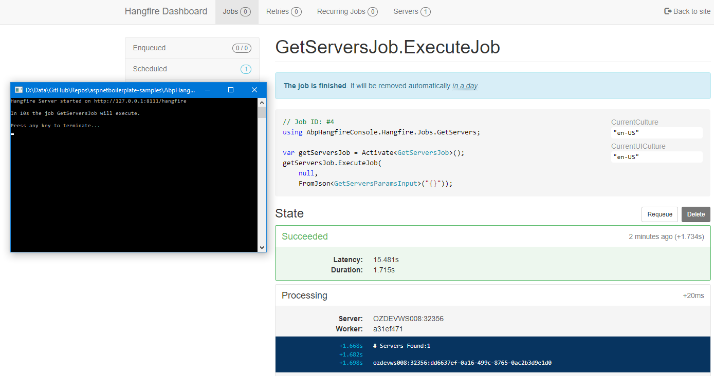

# Overview

This is a console application that has all the necessary ABP plumbing in it to support:

- [Dependency Injection](https://aspnetboilerplate.com/Pages/Documents/Dependency-Injection)
- [Application Services](https://aspnetboilerplate.com/Pages/Documents/Application-Services)
- [Repositories](https://aspnetboilerplate.com/Pages/Documents/Repositories) using Entity Framework Code First backed by SQL Server

The application was patterned on the downloadable MVC template and then adapted to support an OWN based console application.

# What It Does

To ensure that ABP was functionining as expected the application does the following.

When the application is run up it starts a [Hangfire](https://www.hangfire.io/) server on 127.0.0.1:8111/hangfire using OWIN. After 10 seconds the `GetServersJob` will execute
which will list all the servers that Hangfire knows about using an ABP Application Service via an ABP Repository to query the Hangfire data table.

# Extras

The solution contains an assembly `AbpHangfireConsole.Hangfire`. This assembly could be made common among all your ABP applications that are each participating as a server within Hangfire. 

If you descend your input parameters from `HangfireParamsInputBase` then they will also be [validated](https://aspnetboilerplate.com/Pages/Documents/Validating-Data-Transfer-Objects like any regular DTO.

# Installation #

- Amend the `Default` connection string to point at the database of your choice.
